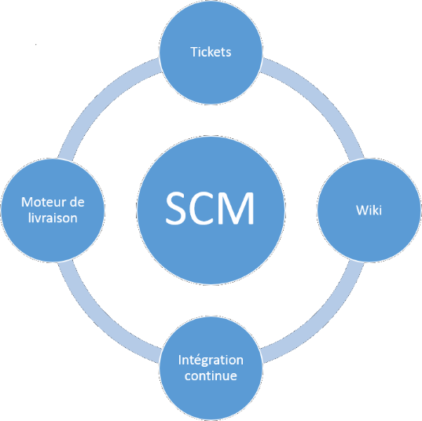
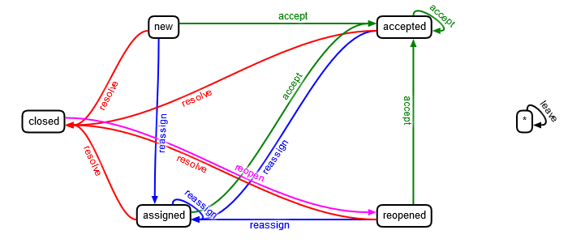

# O.D.E.V.A.

**O**utils supportant le **DEV**eloppement, le déploiement et la maintenance collaborative des **A**pplications


# Collaborer

[https://github.com/seblucas/odeva](https://github.com/seblucas/odeva)


# Livrables

 * Un accès au projet Platine sur Gitlab
 * Document court (1 page) :
   * Répartition des tâches
   * Statégie sur la CI / CD
   * Les problèmes rencontrés
   * Les solutions apportées


# Projet

L'art de travailler ensemble.


# Cycle de vie

 * Analyse
 * Développement
 * Livraison / Recette
 * Mise en production
 * Maintenance


# Pas si simple

 * Livraison par bloc
 * Travail en équipe (offshore)
 * Maintenance (plusieurs années)
 * Plusieurs clients
 * Stress
 * Qualité


# La réalité

> "Un chef de projet est la seule personne au monde à croire que 9 femmes peuvent faire 1 bébé en 1 mois"
> 
> "7 projets informatiques sur 10 ne réussissent pas dans les temps ou pire encore jamais" Codendi


# Besoin de certitude

Une projet se reussit en agissant sur les faits et en travaillant en vérité avec le client, sa hiérarchie et ses collaborateurs.

[C'est presque fini](http://geekandpoke.typepad.com/geekandpoke/2012/10/doad.html)


# Besoin d'outils




# Autres outils


# Wiki

 * Seule source 100% fiable
 * Ouvert à l'extérieur
 * Construit au fur et à mesure
 * Aide mémoire.


# Intégration continue
 * Jenkins, Teamcity, Bamboo, Travis, ...
 * Compilation automatique et immutable
 * Test unitaires
 * Test d'intégration
 * Génération artefacts


# Déploiement auto
 * C'est une réalité
 * Déploiement simplifié.
 * Github, Facebook, Google, Amazon
 * Même des PME de 12 personnes


# SCM


# Lexique

 * SCM (**S**ource **C**ode **M**anagement)
 * VCS (**V**ersion **C**ontrol **S**ystem)
 * SCV (**S**ystême de **C**ontrôle de **V**ersion)


# Historique

 * SCCS: 1972, Bell Labs, Marc J. Rochkind
 * diff: 1974, AT&T, Hunt-McIlroy algorithm
 * RCS: 1982, GNU, Walter F. Tichy
 * patch: 1985, Larry Wall
 * CVS: 1986, Dick Grune
 * Subversion: 2000, CollabNet, Apache
 * Git: 2005, Linus Torvalds


# 2020

Toutes les sociétés n’utilisent pas encore de SCM !


# Principe
 * Plusieurs développeurs travaillent ensemble sur le même projet
 * Chacun dispose de sa copie locale
 * Chacun met à disposition des autres les dernières modifications
 * Co-développement, contrôle de distributions, maintenance.
 * Évolution des changements subis par un ensemble de fichiers


# Tickets


# Principe

 * Liste de choses à faire !
 * Ne pas oublier les petites tâches.
 * Les relire constamment.
 * Aide mémoire.


# Comment bien les utiliser
 * Qui, Quand, Quoi, Pourquoi, Comment, Ou ?
 * Catégorie : Bug, Evolution, ...
 * Étiquettes (Tag).
 * Jalon (Milestone).
 * Propriétaire.
 * Ordonnancement.
 * Phrases à bannir !


# Workflow




# Historique
 * Historique d'un client.
 * Qu'est ce qui a été livré ?
 * Comment a-t-on clôturé un ticket ?
 * Statistiques.


# Petit projet ?


# Exemple petit projet individuel

 * Un service REST en PHP
 * Un contrôleur AngularJS en Javascript
 * Une vue HTML
 * Des dépendances externes (librairies AngularJS, framework CSS, framework PHP, ...)


# Architecture

```bash
user@home:~/src/projet1# ls
Modele.php
Controleur.js
Vue.html
vendor
```


# Nouveaux besoins

 * L'évolution d'un projet informatique n'est pas linéaire (beaucoup de retours en arrière).
 * Besoin de sauvegarde.
 * Envie de garder à disposition la dernière version fonctionnelle.


# Nouvelle architecture

```bash
user@home:~/src/projet1# ls
Modele.bak
Modele.php
Controleur.bak
Controleur.js
Vue.bak
Vue.html
vendor
```


# Nouveaux besoins

 * Besoin de sauvegardes plus anciennes
 * Besoin de trouver des ensembles cohérents


# Nouvelle architecture

```bash
user@home:~/src/projet1# ls
Modele.php.20140302
Modele.php.20140407
Modele.php
Controleur.js.20140302
Controleur.js
Vue.html.20140407
Vue.html
vendor
```

**Cela commence à être complexe**


# Nouveaux besoins

 * Sauvegarde historisée (mail, dropbox, ...).
 * Un fichier texte est ajouté sur chaque répertoire pour préciser ce qui est fait et ce qui reste à faire (aide mémoire).
 * Utilisation régulière de la commande `diff` pour se souvenir des différences de code.


# Deux semaines après : besoin de cohérence

```bash
user@home:~/src# ls
projet1_20140502
projet1_20140503
projet1_20140504
projet1
```


# Bilan sur un projet individuel

 * Besoin d'un historique.
 * Besoin de sauvegarde.
 * Besoin de cohérence.
 * Besoin d'un aide mémoire (texte, `diff`)


# Subversion


# Création

```bash
cd /home/user/svn
svnadmin create monProjet
mkdir /tmp/Projet
mkdir /tmp/Projet/branches
mkdir /tmp/Projet/tags
mkdir /tmp/Projet/trunk
svn import /tmp/Projet file:///home/user/svn/monProjet -m "Import initial"
```


# Copie locale

```bash
cd /home/user/src
svn co file:///home/user/svn/monProjet/trunk maCopieLocale
cd maCopieLocale
```


# svnserve / Apache (dav)

```bash
vi /home/user/svn/monProjet/conf/svnserve.conf
# anon-access = read -> anon-access = write
svnserve -d -r /home/user/svn --listen-port 45001 --foreground
```

```bash
svn co svn://ip:45001/monProjet/trunk distance
```


# Check in / Commit


```bash
touch list.txt
svn add list.txt
(Modifier le fichier)
svn status
svn ci list.txt -m "Ajout de XXX dans la liste"
```


# Check out / Mise à jour


```bash
svn co http://path/to/trunk
svn up
svn revert list.txt
```


# Historique / Différences


```bash
svn log list.txt
svn diff -r3:4 list.txt
```


# Etiquettes / Version


```bash
svn copy http://path/to/revision http://path/to/tag
```


# Branches


```bash
svn copy http://path/to/trunk http://path/to/branch
```


# Fusion


```bash
svn merge -r5:6 http://path/to/branch
```


# Conflits


Gestion manuelle la plupart du temps.


# Git


# Centralisé


# Décentralisé / Distribué


# Avantages DVCS

 * L'historique des versions est toujours disponible
 * Les commits sont toujours possibles (même offline)
 * Beaucoup plus rapide
 * Facilité de création de branches
 * Moins de maintenance


# Plus de complexité

 * La manière de collaborer n'est pas forcée par le système
 * Impossible de savoir où est la dernière version
 * Besoin de cadrer l'organisation.
 * Les numéros de version sont des GUID


# Push / Pull


# Github / Pull request

 * Les contributeurs font des PR
 * Le mainteneur les accepte, les refuse ou demande des modifications
 * Notion de `rebase` pour réécrire l'histoire.
 * Git flow

Nouveau rôle : Intégrateur.


# Github simple

 * Une seule personne partage son dépôt
 * [Ajouter un utilisateur à un dépôt](https://help.github.com/articles/inviting-collaborators-to-a-personal-repository/)


# Github Workflow


# Github Workflow - Remote

 * [Ajout des remote](https://help.github.com/articles/configuring-a-remote-for-a-fork/)
 * [Créer un PR](https://help.github.com/articles/creating-a-pull-request/)
 * [Contribuer à un projet : fork, clone, PR](https://github.com/firstcontributions/first-contributions)


# Gitflow


# Microsoft Flow


# Your Flow

 * A vous
 * Peu de mauvaises solutions
 * Besoin d'expliquer le fonctionnement
 * Gestion des bugfixes claire


# Les commandes GIT

 [La meilleure source à mon avis](http://ndpsoftware.com/git-cheatsheet.html)


# Git / Basique


# TP / Commandes à connaitre

```bash
git log
git diff (--cached)
git status
git config --global core.editor nano
```


# TP / Basique

```bash
cd /home/user/src
git init testGit
git clone testGit testGitLocal
cd testGitLocal/
touch a.txt && git add a.txt
git commit -am "Ajout de a.txt"
```


# TP / Branches

```bash
git checkout -b modif
git branch
touch b.txt && git add b.txt
git commit -am "Ajout de b.txt"
git checkout master
touch c.txt && git add c.txt
git commit -am "Ajout de C.txt"
git merge modif
```


# TP / Push

```bash
cd ../testGit
git config --bool core.bare true
cd ../testGitLocal
git remote -v
git push origin master
```


# TP / .gitignore

[gitignore.io](https://www.gitignore.io)

```bash
cd ../testGitLocal
nano .gitignore
git add .gitignore
git commit -am "Ajout de la liste des ignorés"
git push origin master
```


# TP / pull rebase

```bash
cd /home/user/src
git clone testGit testGitDeux
cd testGitDeux
touch z.txt && git add z.txt
git commit -am "Add z"
git push origin master
cd ../testGitLocal
touch y.txt && git add y.txt
git commit -am "Add y"
git pull --rebase origin master
git push origin master
```


# TP / Conflits

```bash
cd ../testGitDeux
echo "Modification A" >> a.txt
git commit -am "Modification a.txt"
git push origin master
cd ../testGitLocal
echo "Modification B" >> a.txt
git commit -am "Modification a.txt"
git pull --rebase origin master
git push origin master
```


# Tracking des branches

```bash
git push -u origin mabranche
```


# Grands pouvoirs


# Intérêts

 * Avoir le droit de changer d’avis
 * Tester des idées sans conséquence
 * Collaborer avec d’autres personnes
 * Faciliter la **maintenance** ou le déboggage


# Intérêts (suite)
 * Générer des statistiques
 * Gagner du temps
 * Garder sa santé mentale


# Intérêts (suite)
 * Log
 * Blame / Annotate
 * Bisect


# Revue de code

Pas de revue de code sans gestionnaire de source.

Excellent moyen d'apprendre !


# Outils graphiques

[TortoiseSVN](http://tortoisesvn.net/), [TortoiseHG](http://tortoisehg.bitbucket.org/), [Github](https://github.com/), [Bitbucket](https://bitbucket.org/), [SourceTree](https://www.sourcetreeapp.com/), [Github Desktop](https://desktop.github.com/), [GitKraken](https://www.gitkraken.com/), ...


# Grandes responsabilités


# Rien de magique !

 * Un SCM mal utilisé sera certainement plus pénalisant que de ne pas en utiliser.
 * Ce n'est pas le SCM qui va permettre de gérer la communication autour du projet.
 * Un SCM se sauvegarde !
 * Ne jamais toucher aux fichiers internes (.svn, .git, ...)


# Fichiers à exclure
## Règles fermes

 * Aucun résultat de compilation (dll, jar, ...)
 * Aucun fichier spécifique à un ordinateur (préférences, lien d'accès à une base de données, ...)
 * Les fichiers à exclure doivent être **ignorés** (svn:ignore, .hgignore, .gitignore)


# Fichiers à exclure
## Règles négociables

 * Aucun executable ou limiter les fichiers binaires.
 * Limiter les librairies externes (privilégier si possible les outils comme composer, gradle, bower, maven, ...)


# Validation (commit)
## Respecter l'équipe

 * Avant un commit, il faut rafraichir sa copie locale (récupérer les modifications des collaborateurs).
 * Avant de faire un commit, les modifications doivent être testées (par le développeur et via des tests unitaires le cas échéant).
 * Un commit doit avoir un message explicite en bon français.


## Garder la cohérence

 * Un commit ne mélange pas le fond et la forme.
 * Un commit = Un objectif.
 * La suppression ou le renommage se font avec le SCM
 * Les commits doivent être fréquents.
 * Un commit doit être relu.
 * Un commit doit se suffire à lui même.
 * A vous ...


# TOP 8 des pires messages

 * Some shit.
 * It works!
 * fix some fucking errors
 * fix
 * Fixed a little bug...
 * Updated
 * typo
 * Revision 1024!!


# La question Pourquoi ?

 * [Semantic commit messages](https://gist.github.com/joshbuchea/6f47e86d2510bce28f8e7f42ae84c716)
 * Prévoir la recherche future
 * Regarder les commits du noyau Linux


# Conflits

 * Ne pas se lancer la patate chaude.
 * Etre adulte.
 * Un conflit n'est pas à cause de l'autre.


# Règles à suivre

 * Avoir des conflits est normal dans un projet.
 * Règles définies = Moins de conflits.
 * Résoudre un conflit nécessite une reflexion.
 * Si votre SCM détecte un conflit, alors sans SCM, il y aurait eu de la perte de code.


# Le meilleur du pire

[Critiquez](https://github.com/seblucas/BadPractice)


# Travis


# Création fichier basique

Créer un fichier `.travis.yml` à la racine du projet

```yaml
language: java
```

[Dans certains cas cela peut suffire](https://docs.travis-ci.com/user/languages/java/)


# Lien entre Github / Travis

 * Se connecter avec son compte Github à [Travis](https://travis-ci.org/)
 * Activer le dépôt concerné
 * Faire un commit


# TP / Recapitulatif

 * Créer le dépôt Github
 * Ajouter les sources à la racine (pom.xml à la racine)
 * Activer le dépôt dans Travis
 * Créer et pousser le `.travis.yml`
 * Attendre le "vert"


# TP / plusieurs version Java

```yaml
language: java
jdk:
  - openjdk8
  - openjdk9
```


# Un fichier plus complet

```yaml
language: node_js

matrix:
  include:
    - node_js: "5"
    - node_js: "4.2"

before_install:
  - npm install -g bower
  - bower install

script:
  - gulp ci
  - 'if [ "${TRAVIS_NODE_VERSION}" = "4.2" ]; then gulp protractor ; fi'
```


# Des fichiers encore plus complets

 * https://github.com/seblucas/sqlite-enhanced-icu/blob/master/.travis.yml
 * https://github.com/seblucas/firebase-sensor/blob/master/.travis.yml
 * https://github.com/seblucas/cops-html-ui/blob/master/.travis.yml
 * https://github.com/seblucas/cops/blob/master/.travis.yml


# TP / Web

 * Reprendre un projet passé (Web)
 * Créer un projet Github, l'importer
 * Le lier à Travis
 * utiliser les outils de lint (csslint, jslint, bootlint)


# Autres outils intégrés

 * Selenium / Appium : [Saucelabs](https://saucelabs.com/), [Browserstack](https://www.browserstack.com/), [Cypress](https://www.cypress.io/), ...
 * Analyse statique de code : [Codeclimate](https://codeclimate.com), [Scrutinizer](https://scrutinizer-ci.com/), ...
 * Couverture de code : [Coveralls](https://coveralls.io/), la liste précédente
 * Vérification de dépendances : [Versioneye](https://www.versioneye.com/), [David](https://david-dm.org/), [Snyk](https://snyk.io/), ...
 * Documentation : [ReadTheDocs](https://docs.readthedocs.io/en/latest/), [Apiary](https://apiary.io/), ...
 * Déploiement : AWS, Azure, Heroku, Play Store, ...


# TP / Intégration SonarQube

 * Créer ou reprendre un dépôt Github avec un projet Java
 * Suivre la [doc](https://docs.travis-ci.com/user/sonarcloud/) pour intégrer SonarQube
 * Comparez les résultats entre vous


# TP / Exemple sonar-project.properties

```
sonar.projectKey=XXX
sonar.projectName=Test
sonar.projectVersion=1.0-SNAPSHOT

# SQ standard properties
sonar.sources=src/
sonar.language=java
sonar.java.binaries=output/  
```


# Git / Avancé


# Commandes utiles

```bash
git rm --cached <fichier> # annule un add
git checkout -f # Annule toutes les modifications
git reset --hard # Supprime aussi les nouveaux fichiers non suivis
git add -i / -p # commit que d'une partie d'un fichier
git diff --ignore-all-space
```


# Compléter un commit

```bash
git commit --amend (--no-edit)
```

Permet d'écraser le message mais aussi d'ajouter un fichier manquant. Attention ne le faire que si aucun push n'a été fait.


# TP / Rebase (1/2)

```bash
git checkout -b new-feature
# Faites plusieurs modifications et plusieurs commits
git commit -a -m "Début"
git commit -a -m "Modification du précédent"

git checkout master
# 1 commit sur la master
git commit -a -m "Correction pb sécurité"

git checkout new-feature
git rebase -i master
```


# TP / Rebase (2/2)

 * pick : conserver un commit
 * squash/fixup : fusionner deux commits
 * edit : découper un commit
 * reword : renommage de message
 * suppression
 * réordonner

Notion de cherry picking et commit squashing.


# TP / Squash

```bash
git log
git log --graph --decorate --pretty=oneline --abbrev-commit
git rebase -i HEAD~[NUMBER OF COMMITS]
ou
git rebase -i [SHA]
```


# TP / Squash

```bash
git rebase -p --onto SHA^ SHA

git log --abbrev-commit master..
```


# TP / Rebase Attention

Ne jamais utiliser le `rebase` sur des commits qui ne sont pas strictement locaux.


# TP / stash (1/2)

```bash
nano b.txt # Faire des changements
git stash push -m "Sauvegarde des modifications sur b.txt"
git stash list
git stash show -p stash@{0}
git stash pop
git stash list && git status
```


# TP / stash (2/2)

```bash
git stash push -u -m "Sauvegarde des modifications y compris les ajouts"
git stash clear # Attention irrémédiable
git stash branch <branchname> <stashname>
```


# Adapter son prompt

A ajouter dans le `.bashrc`

```
parse_git_branch() {
     git branch 2> /dev/null | sed -e '/^[^*]/d' -e 's/* \(.*\)/(\1)/'
}
export PS1="\u@\h \[\e[32m\]\w \[\e[91m\]\$(parse_git_branch)\[\e[00m\]$ "
```


# Début de projet

 * Créer le dépôt Git
 * Définir les règles
 * Créer l'intégration continue (et vérifier les règles)
 * Créer la livraison continue
 * Ecrire les tickets (avec priorités)
 * Valider l'architecture
 * Commencer le code


# 1 mois après

 * Mettre à jour les tickets
 * Revue de code
 * Formation interne éventuellement
 * Remettre à jour les règles
 * Modifier l'intégration continue
 * Valider que la livraison continue est fiable


# 1 semaine avant fin projet

 * Mettre à jour les tickets
 * Faire des choix
 * Tester, Tester, Tester
 * Valider que la livraison continue est fiable


# Après la livraison

 * Faire un bilan / rétrospective
   * A supprimer
   * A améliorer
   * A conserver


# Bilan

 * Soyez fainéant
   * Ne faites que ce qui est nécessaire
   * Soustraitez le maximum aux machines
 * Automatisez
 * Communiquez


# Bonus // Docker


# Installation VM

 * Lancer Virtualbox
 * Récupérez l'image disque  : [ici](https://github.com/seblucas/odeva/releases/tag/1.0.0)
 * La dezipper
 * Créer une VM de type Linux / Ubuntu 64bits
 * Ne pas créer de nouveau disque mais pointer sur le disque téléchargé


# Installlation sur Ubuntu 20.04

```bash
sudo apt install docker.io
sudo systemctl enable --now docker
sudo usermod -aG docker SOMEUSERNAME
```


# Principes

 * Docker == conteneur != machine virtuelle
 * Moins sécurisé (partage le noyau)
 * Plus léger 


# Registry : Docker hub

 * Source de vos images de base
 * ubuntu / alpine / etc
 * `docker run --rm hello-world`


# TP / Arriere plan

```bash
docker run -d -p 8080:80 nginx
# -d : detached // arrière plan
# -p : transfert de port
wget http://localhost:8080 
```


# TP / Rentrer dans un conteneur

```bash
docker ps -a # liste les conteneurs
docker exec -it ID_RETOURNÉ_LORS_DU_PS bash
wget http://localhost:80 # dans le conteneur
## CTRL + D pour sortir ##
```


# TP / Stopper supprimer

```bash
docker ps -a # liste les conteneurs
docker stop ID_RETOURNÉ_LORS_DU_PS
docker rm ID_RETOURNÉ_LORS_DU_PS
```


# TP / Dockerfile

```
FROM alpine:3.12

RUN apk --no-cache --update add python3 && \
    rm -rf /tmp/* /var/tmp/* /var/cache/apk/*

WORKDIR /app

COPY hello.py .

CMD ["python3", "hello.py"]
```


# TP / Dockerfile - hello.py

```
print("Hello, World!")
```


# TP / Dockerfile - build

```bash
docker build -t testmaster:latest .
docker run -it --rm testmaster:latest
```


# TP / Structure en couche / layer

```bash
echo -e "\nprint(\"Very new world\")" >> hello.py
docker build . -t testmaster:latest
# Seules les couches modifiées sont reconstruites
docker run -it --rm testmaster:latest
```


# Suite

 * docker-compose
 * push / pull
 * Lien avec VS Code pour développer dans un conteneur
 * Kubernetes
